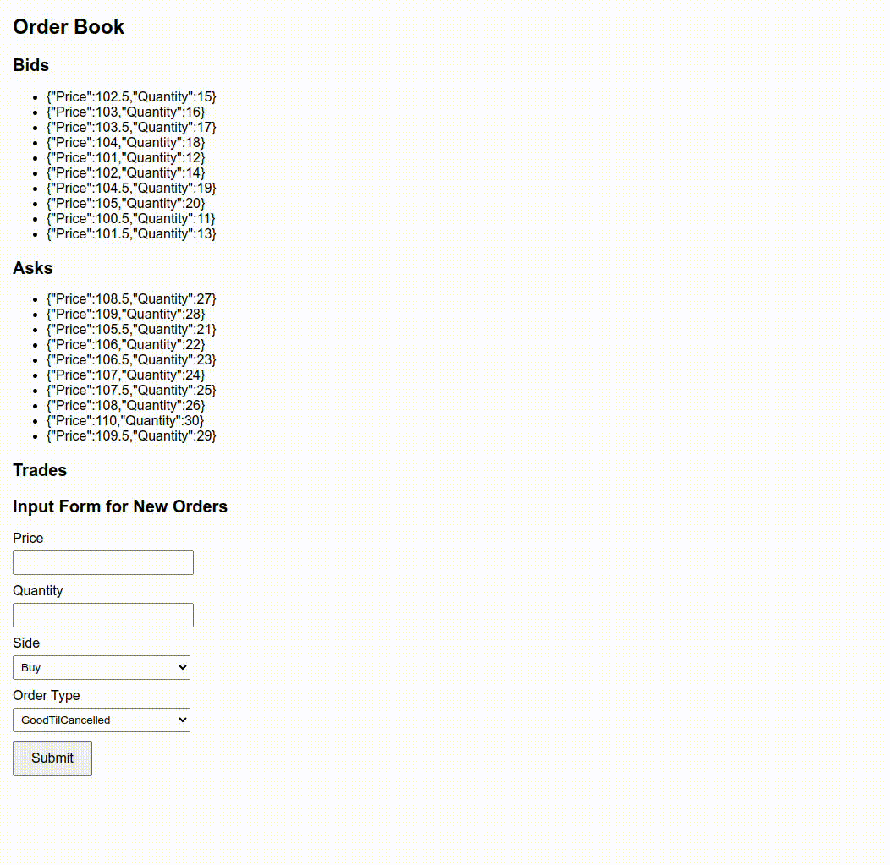

# Limit Orderbook

Basic implementation of an orderbook matching engine for limit orders written in Go

* Support for `Market`, `FillOrKill`, `FillAndKill`, and `GoodTilCancelled` order types
* Sample website simulator for creating and monitoring Bids and Asks
* Standard price time priority

